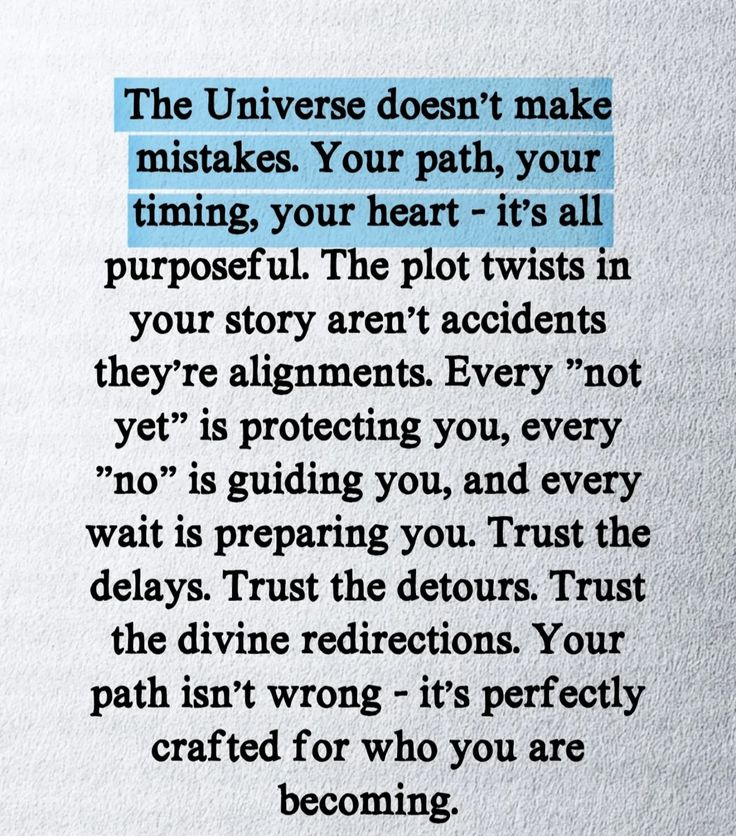

# cout<<"hello world!!";

still figuring out.

I am no more a teen, I lost it today because today is my 20th birthday. My experience in these 20 years of living on earth is a mixed emotion roller coaster. I have always been a quiet observer of my environment and the world evolving at the speed of light, but I learned many things and quite frankly, I am grateful for this journey.

Throughout these years, I faced confusions, heartbreak, and loneliness, but I believe everything happens for a reason. I am still figuring out the answers to my curiosity, still searching for meaning in the experiences that shaped me. Each challenge has taught me something valuable, and I know this journey of self-discovery is far from over.

Looking back at these two decades, I realize how much I have changed yet stayed the same. The dreams I had as a child seem both distant and familiar. Some have evolved, others have faded, and new ones have emerged from unexpected places. The world around me keeps spinning faster, technology advancing, people changing, yet here I am, trying to make sense of it all.

The loneliness taught me the value of solitude. The heartbreak showed me my capacity to feel deeply and love genuinely. The confusion reminded me that not having all the answers is part of being human. These were not just obstacles; they were teachers in disguise.

As I step into this new chapter, I carry with me the lessons of the past and the hope for the future. I do not know what lies ahead, and maybe that is okay. Maybe the beauty of life lies in its unpredictability, in the questions that remain unanswered, in the journey that continues to unfold.

Here is to 20 years of existing, learning, failing, and growing. Here is to the many more years of discovery that await.

