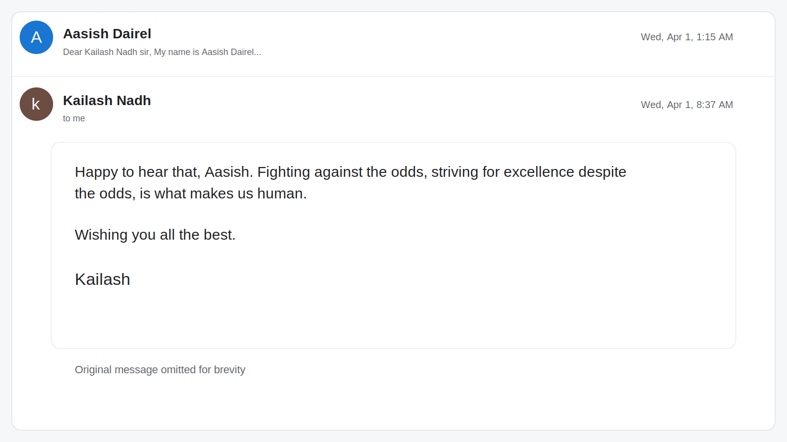

# The Moment He Replied

There are some people who quietly shape the way you think, even if you have never met them.

For me, Kailash Nadh, CTO of Zerodha, was one of those people. He was my inspiration and my role model. During some of the toughest times in my life, I would watch his interviews and listen to his podcasts just to remind myself to keep going. His words gave me strength when I needed it most.

At some point, I decided to write to him and tell him what his work had meant to me. I did not expect anything in return. I just wanted him to know that his words had reached someone on the other side of the screen and made a real difference.

Then he replied.

That response came as a surprise, and it became one of the happiest moments of my life. It was not just about getting a reply. It was about feeling seen by someone I had admired for so long. In that moment, all the encouragement I had borrowed from him came back to me in a deeply personal way.

I will always remember that day. It reminded me that small acts of kindness can stay with a person far longer than we realize, and that the people we look up to can sometimes give us more than motivation. They can give us hope.
